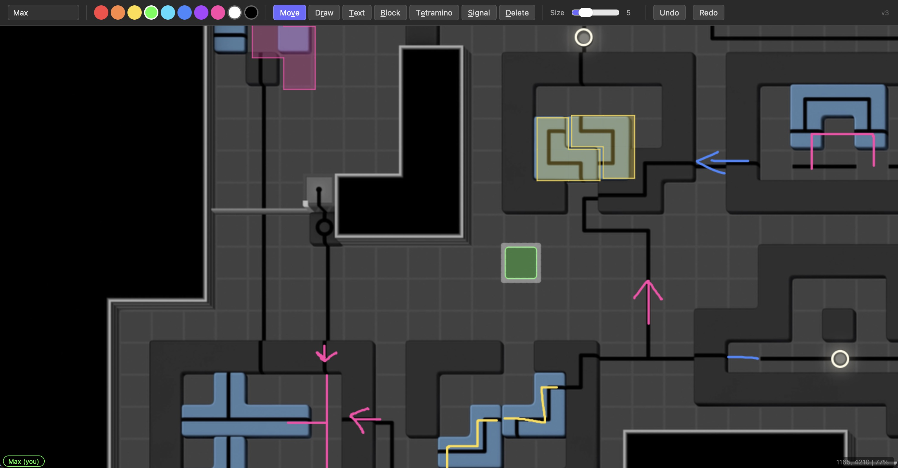

# 0PLAYER

Real-time collaborative image editor for https://plus.cerisetalis.com/0PLAYER/.
Multiple players draw, place text, and arrange shapes simultaneously with synced state and live cursor tracking.



## Quick Start

```
npm install
node server.js
```

Open `http://localhost:3000`. For public access, use ngrok:

```
ngrok http 3000
```

## Tools

| Tool | Key | Description |
|------|-----|-------------|
| **Move** | V | Select and drag any annotation. Highlights on hover. Drag position syncs in real time. |
| **Draw** | R | Freehand drawing. Adjustable size via slider. |
| **Text** | T | Click to place a text input. Press Enter to commit, Escape to cancel. |
| **Block** | B | Click and drag to create an n x m grid of blocks. |
| **Tetramino** | E | Draw arbitrary connected shapes cell by cell. |
| **Signal** | S | Togglable signal light. |
| **Delete** | D | Hover to highlight, click to delete. |

Blocks and tetraminos act as containers — when dragged, any overlapping pen strokes and text move with them.

## Controls

- **Pan**: middle-click drag, space+drag, or two-finger trackpad scroll
- **Zoom**: mouse wheel, trackpad pinch, or ctrl+scroll
- **Touch**: 1 finger draws, 2 fingers pan/zoom

## Architecture

```
server.js          Express + Socket.IO server
public/index.html  Full client (HTML + CSS + JS)
state.json         Persisted annotations (auto-saved, debounced 1s)
version.txt        Manual version number (edit to trigger client update banner)
backup.sh          Backs up state.json to backup/ every minute
```

## Real-time Features

- **Annotations**: all drawing/text/shapes sync instantly via Socket.IO
- **Cursors**: each player's cursor position + name shown to others
- **Viewports**: other players' visible areas shown as dashed rectangles
- **Off-screen indicators**: arrows at screen edge point toward off-screen players
- **Drag sync**: moving annotations broadcasts position every 100ms
- **Player list**: bottom-left shows all connected players with colors

## State & Persistence

- Annotations stored in memory, persisted to `state.json` on every change (1s debounce)
- Player name, color, and viewport (pan/zoom) saved to localStorage
- Undo/redo stack is per-player, per-session (in memory only, resets on disconnect)
- Players expire after 15 seconds of inactivity. The `/version` poll doubles as heartbeat.
- `backup.sh` copies `state.json` to `backup/state-YYYYMMDD-HHMMSS.json` every minute

